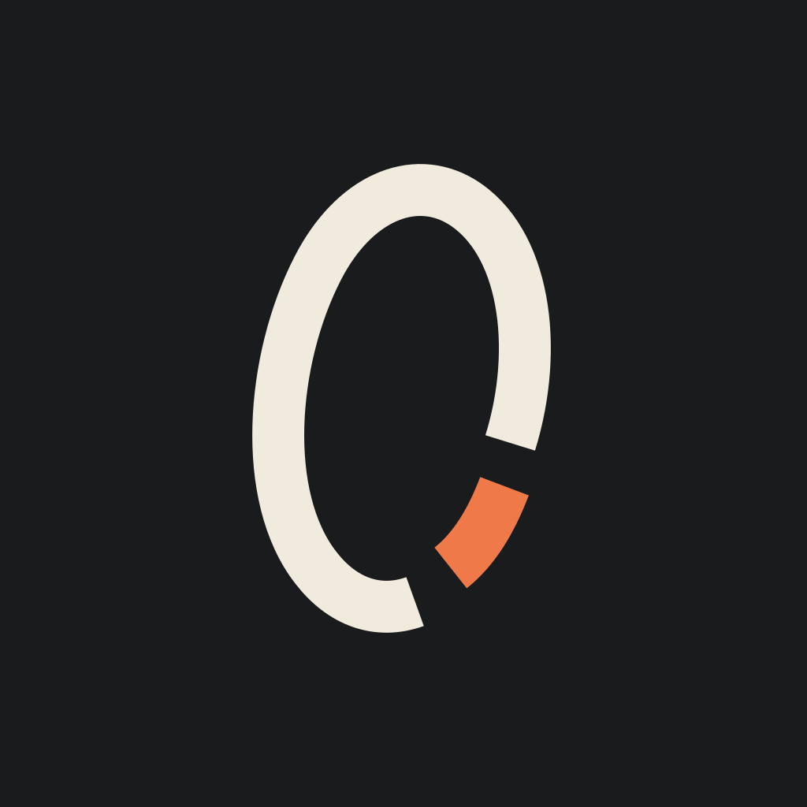

<p align="center">
  
</p>

<h1 align="center">Portal</h1>

<p align="center">
  A real Linux desktop on your Android tablet. Debian 13 and KDE Plasma 6, no root, no PC, no streaming.
</p>

<p align="center">
  <a href="https://github.com/Retrorerr/Portal/releases"></a>
  <a href="https://github.com/Retrorerr/Portal/actions/workflows/build.yml"></a>
  <a href="LICENSE"></a>
  
</p>

Portal installs Debian on your device and runs the full KDE Plasma desktop right on the screen, with GPU acceleration, sound, your keyboard and mouse, and the Android clipboard all hooked up. It's everything running locally, not a remote desktop or a VNC window.

> **Heads up:** Portal is in early pre-release. It's built and tested on a **OnePlus Pad 3** (Snapdragon 8 Elite, Adreno 830). Other 64-bit Android devices might work, but nobody has checked yet, and GPU acceleration is built around Qualcomm Adreno GPUs. Bug reports from other devices are very welcome.

## Getting started

1. Grab the latest `Portal-x.y.z.apk` from [Releases](https://github.com/Retrorerr/Portal/releases) and install it.
2. Open Portal, pick a theme and interface size, and tick any extra apps you want.
3. Tap **Begin Install**. Portal downloads Debian (about 1 GB) and sets everything up. Plan for around 6 GB of free space, and keep the app open while it works.
4. When it's done, swipe up to enter your desktop.

If setup gets interrupted, just open Portal again. It picks up where it left off.

## What you get

**Out of the box:** Firefox, Dolphin (files), Konsole (terminal), Kate (text editor), Okular (documents), Gwenview (images), Ark (archives), KCalc and System Settings. Handy command-line tools are included too: `git`, `htop`, `nano`, `curl`, `ping`, `man` and friends.

**Optional apps** (pick them during setup, or add and remove them later from the apps panel when you return to Portal): Claude, ChatGPT, LibreOffice, Thunderbird, GIMP, Krita, Inkscape, VLC and Steam.

**Anything else** you can install the normal Debian way. You're the `desktop` user and `sudo` works without a password:

```bash
sudo apt update
sudo apt install gnome-calculator
```

Third-party `.deb` files and APT repos work too, as long as they're arm64. Graphical apps show up in the Plasma launcher after you install them.

## Gaming

Pick Steam during setup and you get the ARM64 Steam client running natively.

- Native ARM64 Linux games run directly.
- x86 Linux games run through Box64 (Kerbal Space Program works, for example).
- Windows games through Proton and FEX are early days, so expect hit and miss.
- Controllers connected to Android show up in Steam as Xbox controllers. There are also on-screen touch controls, and their toggle only shows up while a game is running.

## Good to know

- **Keyboard shortcuts:** Android can swallow shortcuts like `Alt+Tab` or `Ctrl+C` before they reach Linux. Turn on Portal under **Android Settings → Accessibility → Downloaded apps** to fix that. It only forwards key presses and doesn't read anything on screen.
- **Tablet or desktop:** with no keyboard or mouse plugged in, Plasma switches to tablet mode and the Android keyboard pops up when you tap a text field. Plug in a keyboard and mouse and it goes back to desktop mode.
- **Sound** goes through Android, and pausing and resuming Portal doesn't break it. You might notice a "Portal Audio (standby)" device in the volume list. That's what keeps apps connected while Portal is in the background, so leave it be.
- **Your Android files:** grant **All files access** if you want to open shared storage (Downloads, Pictures and so on) from Linux. Debian itself lives in Portal's private storage.
- **Browsers:** Firefox, Chromium and Electron apps run with their normal sandboxes on, no `--no-sandbox` needed. If you'd rather use Mozilla's own Firefox build than Debian's, add Mozilla's APT repo and `sudo apt install firefox`, and Portal sets it up automatically.
- **Uninstalling Portal deletes the whole Linux install**, so copy out anything you care about first.

## Known limitations

- There's no systemd, so `systemctl`, `timedatectl`, `hostnamectl` and friends don't work. Apps that only run as systemd services need starting by hand.
- Android can pause or kill apps in the background, so long downloads or builds are safest with Portal on screen.
- If the whole desktop suddenly vanishes under heavy load, Android's child-process limit is the likely cause. Some devices let you turn it off under **Developer options → Disable child process restrictions**.
- Only arm64 packages install with `apt`. x86 programs need Box64 or FEX.

## Something broke?

If Plasma fails to start, Portal shows a recovery screen with **Export diagnostics**, which bundles Portal's logs and setup state (not your personal files). Please [open an issue](https://github.com/Retrorerr/Portal/issues) with:

- your device and Android version
- your Portal version
- what you did and what happened
- the diagnostics file, if you have one

## How it works

```text
Android (display · touch · keyboard · audio · clipboard · files)
   │
Portal app (Rust host + Compose screens)
   │  GPU frames: KWin → Mesa (freedreno / Turnip) → Android buffers
   │
Debian 13 in PRoot (rootless)
   │
KDE Plasma 6 and your Linux apps
```

Debian runs under a patched PRoot, so nothing needs root. Plasma's compositor (KWin) renders on the GPU through Mesa and hands finished frames straight to Android, with no copying and no VNC in between. A simpler Smithay-based renderer stays in as a fallback. Audio runs through PipeWire, with an Android AAudio output on the other end.

More detail: [architecture](docs/architecture.md), [Debian provisioning](docs/debian-provisioning.md), [user guide](docs/user-guide.md).

## Building it yourself

You'll need Rust, the Android SDK and NDK, and the vendored `xbuild`:

```bash
git clone https://github.com/Retrorerr/Portal.git
cd Portal
cargo install --path patches/xbuild/xbuild --force
x build --release --platform android --arch arm64 --format apk
```

On Windows, `./scripts/build_android_variants.ps1` builds both app variants in one go:

- **Portal** (`app.polarbear.portal`) is the normal app. Its build comes out unsigned, so sign it before installing.
- **Portal Debug** (`app.polarbear`) has extra diagnostics and a badged icon, and installs alongside Portal with its own separate Debian.

There's also an on-device Termux build: `bash scripts/build-termux.sh`.

Before sending changes, run the host checks:

```bash
cargo fmt --all -- --check
cargo test --tests
```

See [CONTRIBUTING.md](CONTRIBUTING.md) for the rest, and [SECURITY.md](SECURITY.md) for reporting security issues privately.

## Credits

Portal grew out of [Local Desktop](https://github.com/localdesktop/localdesktop.github.io), and its history and GPL-3.0 license are kept intact. The GPU path builds on [lfdevs' Anland](https://github.com/lfdevs/anland-termux) KWin work and Mesa's freedreno and Turnip drivers.

App names and logos shown in Portal (Firefox, LibreOffice, ChatGPT, Claude and others) belong to their owners. Portal only uses them to show which apps it installs and isn't affiliated with any of them. Icon sources and licenses are in [third_party/app-icons](third_party/app-icons/README.md).
